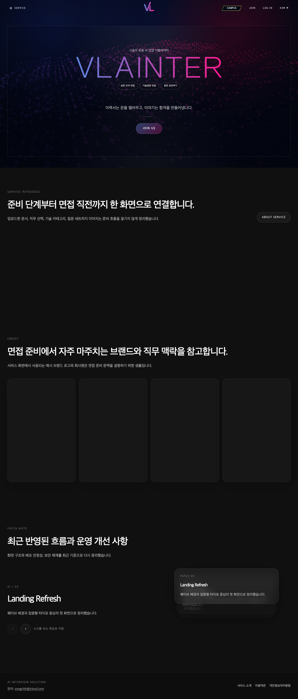
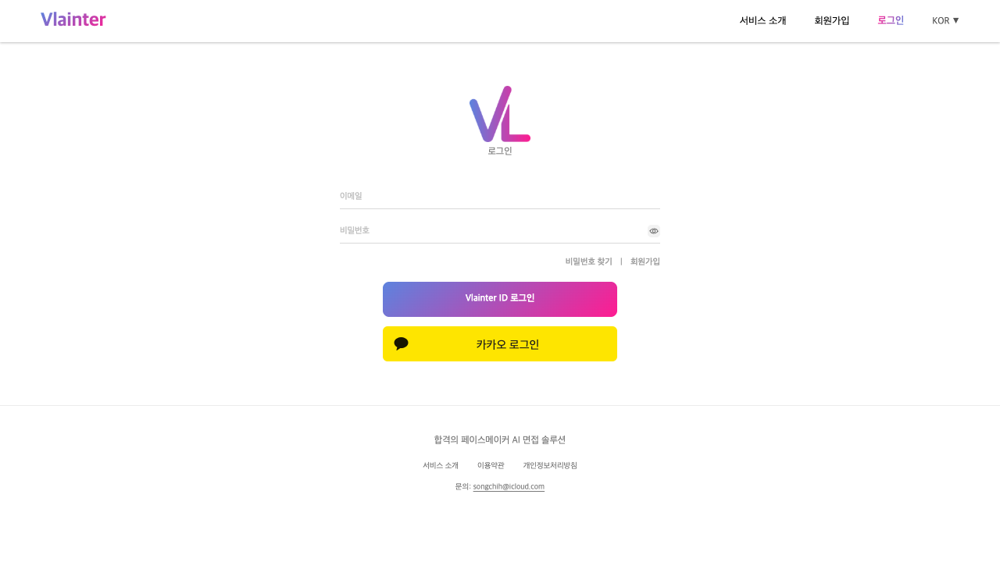
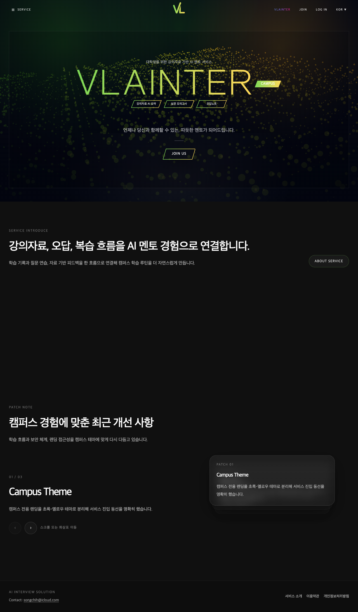

# 🎤 VlaInter

<div align="center">


<h3>AI가 면접관이 되는 순간</h3>
<p>기술 면접부터 이력서 기반 개인화 면접, 학생 학습 흐름까지 연결하는 AI 인터뷰 플랫폼</p>

</div>

---

## 💡 Why VlaInter?

> "이 질문이 정말 내 경험을 보고 나온 걸까?"

많은 면접 준비 서비스는 단순한 질문 생성에서 멈춥니다.  
VlaInter는 실제 준비 흐름이 끊기지 않도록 질문 생성, 답변 평가, 문서 분석, 학습 복기까지 한 흐름으로 연결합니다.

- 기술 스택 기반 실전 면접
- 이력서/자기소개서/포트폴리오 기반 개인화 질문
- 학생 과목/자료 기반 요약, 시험, 오답노트
- AI 모범 답안 생성과 피드백
- 세션 저장 및 복기 기능

## ✨ Core Features

### 1️⃣ 기술 면접 모드

- 직무와 기술 스택 기반 질문 생성
- 답변 제출 후 AI 모범 답안과 피드백 제공
- 저장 질문과 질문 세트 관리
- 세션 결과와 이력 조회

### 2️⃣ 이력서 기반 개인화 면접

- 이력서, 자기소개서, 포트폴리오 업로드
- 문서 기반 질문 생성과 면접 세션 시작
- 경험 중심 맞춤 질문 연습
- 답변 평가와 이력 관리

### 3️⃣ 학생 학습 모드

- 과목 생성과 학적 정보 기반 학습 진입
- 강의 자료 업로드와 유튜브 자료 요약
- 시험 세션 생성과 제출
- 오답노트, 요약 문서, 복습 흐름 제공

### 4️⃣ 운영 및 관리 기능

- 관리자 콘솔
- 질문/카테고리/사이트 설정 운영
- 포인트 충전과 패치노트 확인
- 사용자 문의 및 리포트 접수 흐름

---

# VlaInter Frontend

VlaInter 프론트엔드는 React + Vite 기반 SPA로, 취업 준비생용 AI 면접 연습 흐름과 대학생용 학습 보조 흐름을 하나의 앱 안에서 함께 제공합니다.

## 화면 예시

### 메인 랜딩



### 로그인 화면



### 대학생 랜딩



위 이미지는 로컬 Vite 개발 서버 기준 공개 화면을 캡처한 예시입니다.

## 주요 기능 소개

- 취준생 모드 랜딩, 서비스 소개, 회원가입/로그인, 카카오 로그인
- 문서 기반 모의면접 시작, 기술 질문 연습, 세션 결과/히스토리 조회
- 저장 질문, 질문 세트, 문서 업로드, 포인트 충전 UI
- 대학생 모드 랜딩, 과목 관리, 자료 업로드, 시험 세션, 오답노트
- 마이페이지에서 프로필, 서비스 모드, 학적 정보, Gemini API Key, 포인트 이력 관리
- 관리자 콘솔에서 회원, 질문/카테고리, 운영 설정, 패치노트, KPI 확인

## 기술 스택 소개

| 구분 | 사용 기술 |
| --- | --- |
| Framework | React 19, Vite 7 |
| Routing | React Router DOM 6 |
| UI / Motion | CSS, Tailwind 유틸리티 스타일, Framer Motion |
| Utilities | html2canvas, jsPDF, react-icons |
| Auth Integration | Cookie-based session, Kakao OAuth |
| Build / Lint | Vite, ESLint |

## 화면 / 서비스 구조

| 구역 | 주요 경로 | 설명 |
| --- | --- | --- |
| 공개 화면 | `/`, `/campus`, `/about`, `/terms`, `/privacy` | 랜딩과 소개, 약관/정책 |
| 인증 화면 | `/login`, `/join`, `/password/forgot`, `/auth/kakao/callback` | 로그인, 회원가입, 비밀번호 찾기 |
| 공통 진입점 | `/content`, `/content/service-mode`, `/content/mypage` | 로그인 후 서비스 모드 분기와 공통 설정 |
| 취준생 모드 | `/content/interview`, `/content/tech-practice`, `/content/files`, `/content/question-sets` 등 | 면접/질문/문서/결제 흐름 |
| 대학생 모드 | `/content/student`, `/content/student/courses/:courseId`, `/content/student/sessions/:sessionId` | 과목/자료/시험/오답노트 |
| 관리자 | `/content/admin` | 운영자 전용 콘솔 |

### 사용자 흐름

1. 공개 랜딩 또는 로그인 화면에서 인증
2. `/content` 진입 시 프로필의 `serviceMode`를 확인
3. 취준생이면 `/content/interview`, 대학생이면 `/content/student`, 미선택이면 `/content/service-mode`로 이동
4. 취준생 주요 화면은 일부 기능에서 Gemini API Key 등록이 필요

## 빠른 시작

`git pull` 또는 클론 직후 아래 순서대로 진행하면 됩니다.

모노레포 루트에서 시작했다면 먼저 `cd vlainter_FE/vlainter`로 이동한 뒤 아래 명령을 실행하세요.

### 1. 환경 변수 파일 준비

```bash
cp .env.example .env
```

필수 항목:

- `VITE_API_BASE_URL`
- `VITE_KAKAO_CLIENT_ID`
- `VITE_KAKAO_AUTH_URI`
- `VITE_KAKAO_REDIRECT_URI`

선택 항목:

- `VITE_PORTONE_PG`

### 2. 의존성 설치

```bash
npm install
```

### 3. 개발 서버 실행

```bash
npm run dev
```

기본 개발 주소는 `http://localhost:5173`입니다.

### 4. 프로덕션 빌드 확인

```bash
npm run build
npm run preview
```

## 환경 변수 가이드

| 변수 | 설명 |
| --- | --- |
| `VITE_API_BASE_URL` | 백엔드 API 기본 주소. 기본값은 `http://localhost:8080` |
| `VITE_KAKAO_CLIENT_ID` | 카카오 OAuth 클라이언트 ID |
| `VITE_KAKAO_AUTH_URI` | 카카오 인증 페이지 주소 |
| `VITE_KAKAO_REDIRECT_URI` | 카카오 로그인 완료 후 복귀할 프론트 주소 |
| `VITE_PORTONE_PG` | 포인트 결제에 사용할 PG 코드. 미설정 시 `html5_inicis` |

## API 연동 방식

- 모든 API 요청은 기본적으로 `VITE_API_BASE_URL`을 기준으로 호출합니다.
- 인증 방식은 Bearer token 헤더가 아니라 `credentials: include` 기반 쿠키 세션입니다.
- `401`이 발생하면 `/api/auth/refresh`를 통해 세션 갱신을 한 번 더 시도합니다.
- 보호 화면 진입 시 `BrowserSessionGuard`가 프로필 조회로 브라우저 세션 유효성을 확인합니다.
- 취준생 주요 화면은 `GeminiApiKeyGuard`가 한 번 더 확인하므로, 로그인 후에도 Gemini API Key 미등록 상태면 제한될 수 있습니다.

## 프로젝트 구조

```text
src
├── assets        # 로고, 아이콘, 이미지
├── components    # 공통 UI, Guard, Sidebar, Modal
├── hooks         # 재사용 훅
├── lib           # API 클라이언트, 세션/도메인 유틸
├── pages
│   ├── auth      # 로그인, 회원가입, 비밀번호 찾기
│   ├── content   # 취준생/학생/관리자 보호 화면
│   └── *.jsx     # 공개 페이지, 정책 페이지
├── App.jsx       # 전체 라우팅 정의
└── main.jsx      # 앱 엔트리포인트
```

## 검증 방법

```bash
npm run lint
npm run build
```

추가 수동 검증 권장 항목:

1. `/` 랜딩 로드
2. `/login` 폼 렌더링
3. `/campus` 랜딩 로드
4. 로그인 후 `/content` 서비스 모드 분기 확인
5. Gemini API Key 미등록 상태에서 취준생 보호 화면 진입 제약 확인

## 현재 제약 사항

- 프론트 전용 테스트 러너는 아직 구성되어 있지 않습니다.
- 따라서 자동 검증 기준은 현재 `lint + build` 중심입니다.
- 보호 화면을 깊게 검증하려면 백엔드가 함께 실행 중이어야 합니다.
- 관리자 화면 캡처나 공유 시 회원 정보, 접속 이력, 결제 데이터는 반드시 마스킹해야 합니다.

## 참고

- 라우팅의 중심은 [src/App.jsx](./src/App.jsx)입니다.
- `/content` 진입 분기 로직은 [src/pages/content/ContentEntryPage.jsx](./src/pages/content/ContentEntryPage.jsx)에서 확인할 수 있습니다.
- API 클라이언트와 refresh 로직은 [src/lib/apiClient.js](./src/lib/apiClient.js)에서 확인할 수 있습니다.
